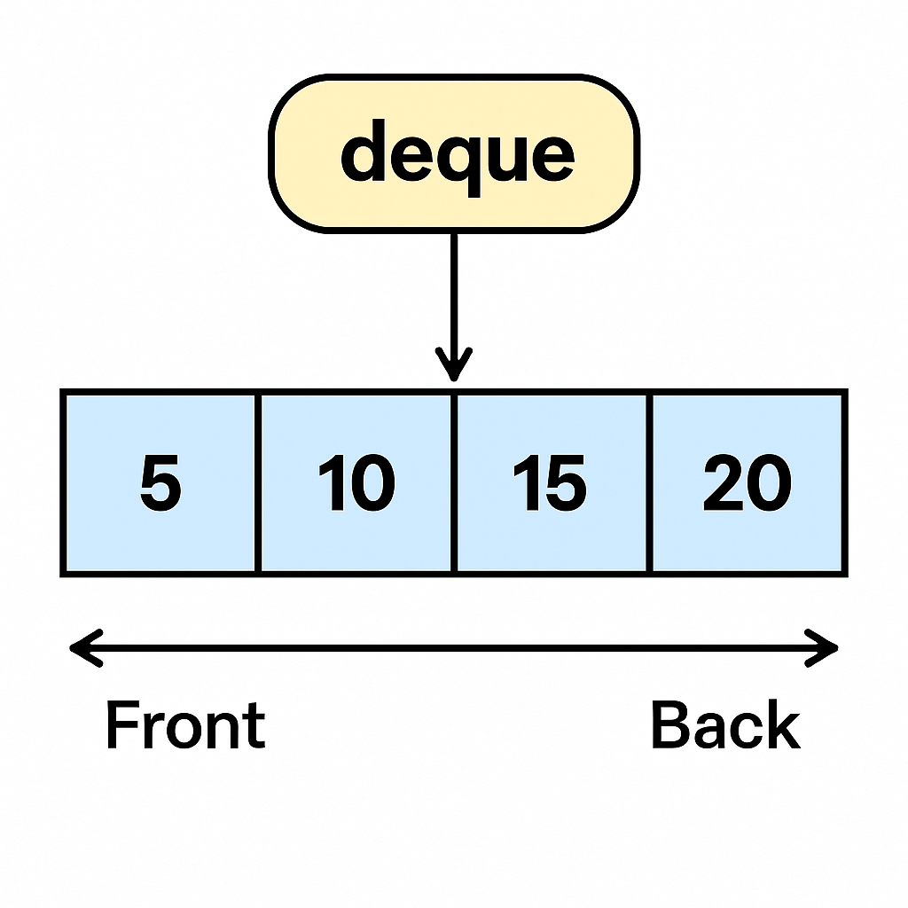

## 🚪 **What is a `deque` in C++?**

`deque` stands for **Double-Ended Queue**.

It is a **sequence container** like `vector`, but with an important feature:

✅ You can insert **and** delete elements from **both ends** — front and back.



---

## 📦 **Characteristics of `deque`**

| Feature                | Description                                        |
| ---------------------- | -------------------------------------------------- |
| **Dynamic Array**      | Grows and shrinks as needed                        |
| **Insertion/Deletion** | Fast at both front and back                        |
| **Random Access**      | Can access elements by index (like an array)       |
| **Memory**             | Not continuous like a `vector`                     |
| **Performance**        | - Slightly slower than `vector` for middle inserts |
|                        | - Faster than `list` for random access             |

---

## 🌲 **Basic Operations**

Here are the main functions you can use with `deque`:

| Operation          | Example           | Meaning                       |
| ------------------ | ----------------- | ----------------------------- |
| Insert at end      | `d.push_back(x)`  | Add `x` at the back           |
| Insert at front    | `d.push_front(x)` | Add `x` at the front          |
| Delete from end    | `d.pop_back()`    | Remove element from the back  |
| Delete from front  | `d.pop_front()`   | Remove element from the front |
| Access element     | `d[i]` or `at(i)` | Get the `i-th` element        |
| Get front element  | `d.front()`       | First element                 |
| Get back element   | `d.back()`        | Last element                  |
| Size               | `d.size()`        | Number of elements            |
| Clear all elements | `d.clear()`       | Remove all elements           |

---

## 📝 **Example Code: `deque` in action**

```cpp
#include <iostream>
#include <deque>
using namespace std;

int main() {
    deque<int> d;

    d.push_back(10);
    d.push_front(5);
    d.push_back(20);

    cout << "Deque elements: ";
    for (int x : d) {
        cout << x << " ";
    }

    cout << "\nFront: " << d.front();
    cout << "\nBack: " << d.back();

    d.pop_front();
    d.pop_back();

    cout << "\nAfter popping: ";
    for (int x : d) {
        cout << x << " ";
    }

    return 0;
}
```

**Output:**

```
Deque elements: 5 10 20 
Front: 5
Back: 20
After popping: 10 
```

---

## 🎯 **When to Use `deque`?**

✅ When you need **efficient insertions/removals** at both front **and** back.
✅ When you need **random access** like an array.
❌ If you only insert at the back, `vector` is usually better.

---

## 🌟 Summary

| `vector`                  | `deque`                    | `list`                 |
| ------------------------- | -------------------------- | ---------------------- |
| Fast random access        | Fast random access         | Slow random access     |
| Insert/delete at end only | Insert/delete at both ends | Insert/delete anywhere |
| Continuous memory         | Non-continuous memory      | Doubly linked list     |