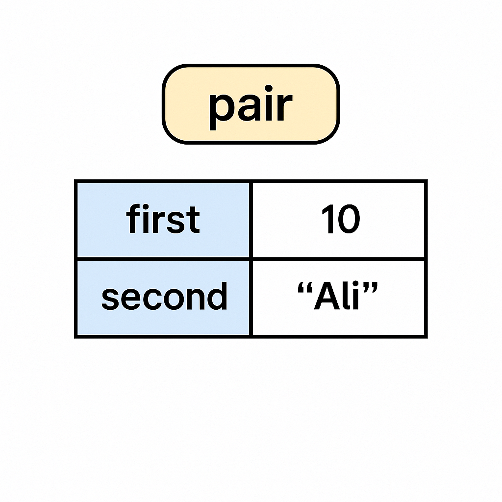

## 📝 What is `pair` in C++ STL?

* A `pair` is a **container** that stores **two heterogeneous values** as a single unit.
* It's part of the **utility** library (`#include <utility>`).
* Think of it as a **tuple with exactly two elements**.



---

## 🌸 Structure of a Pair

```
+-----------------+
|   pair<T1, T2>  |
+-----------------+
|  first  | 10    |
|  second | "Ali" |
+-----------------+
```

* **first** → Stores the first value.
* **second** → Stores the second value.

---

## 📦 Example Code

```cpp
#include <iostream>
#include <utility>
using namespace std;

int main() {
    pair<int, string> p = {10, "Ali"};

    cout << "First: " << p.first << endl;   // 10
    cout << "Second: " << p.second << endl; // Ali

    return 0;
}
```

---

## 🎯 Usage Scenarios

* Returning multiple values from a function.
* Key-value pairs in maps.
* Storing coordinates, etc.

```
+-------------------+
|      pair         |
+-------------------+
| first  |  10      |
| second |  "Ali"   |
+-------------------+
```