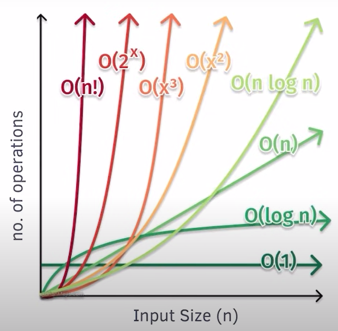

## 🧠 **1. Time Complexity**

### **Definition:**

Time complexity measures **how the execution time** of an algorithm **grows** with the size of the input `n`.

### **Common Notations:**

* **Big O (O):** Worst-case time
* **Big Ω (Omega):** Best-case time
* **Big Θ (Theta):** Average-case or tight bound

### **Mathematical Formula (Conceptual):**

Let:

* `T(n)` be the number of operations an algorithm performs as a function of input size `n`.

Then:

* **Time Complexity = T(n) ≈ O(f(n))**, where `f(n)` is a simplified expression.

### **Examples:**

1. **Constant Time – O(1):**

   ```cpp
   int getFirst(int arr[]) {
       return arr[0];
   }
   ```

   ➤ Time doesn't depend on input size.

2. **Linear Time – O(n):**

   ```cpp
   void printArray(int arr[], int n) {
       for(int i = 0; i < n; i++) {
           cout << arr[i] << " ";
       }
   }
   ```

   ➤ One operation per input element.

3. **Quadratic Time – O(n²):**

   ```cpp
   void printPairs(int arr[], int n) {
       for(int i = 0; i < n; i++) {
           for(int j = 0; j < n; j++) {
               cout << arr[i] << ", " << arr[j] << endl;
           }
       }
   }
   ```

   ➤ Nested loops grow time as n².

---

## 🧠 **2. Space Complexity**

### **Definition:**

Space complexity measures **how much extra memory** (apart from input) an algorithm uses as the input size grows.

### **Mathematical Formula (Conceptual):**

Let:

* `S(n)` be the amount of memory an algorithm uses for input size `n`.

Then:

* **Space Complexity = S(n) ≈ O(g(n))**, where `g(n)` expresses memory growth.

### **Examples:**

1. **Constant Space – O(1):**

   ```cpp
   int sum(int a, int b) {
       return a + b;
   }
   ```

   ➤ Uses only a few variables, regardless of `n`.

2. **Linear Space – O(n):**

   ```cpp
   int* copyArray(int arr[], int n) {
       int* newArr = new int[n];
       for(int i = 0; i < n; i++)
           newArr[i] = arr[i];
       return newArr;
   }
   ```

   ➤ Allocates memory proportional to input size.

3. **Quadratic Space – O(n²):**

   ```cpp
   int matrix[n][n]; // 2D array
   ```

   ➤ Uses n² space for storing all elements.

---

## 🔁 Summary Table

| Complexity Type | Time Example          | Space Example        |
| --------------- | --------------------- | -------------------- |
| O(1)            | Accessing 1st element | Few variables        |
| O(n)            | Single loop           | Dynamic array copy   |
| O(n²)           | Nested loops          | 2D matrix allocation |

---


